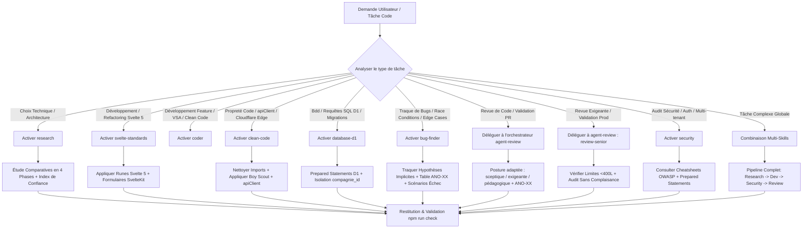

# 🤖 Orchestrateur Agent Code (`agent-code`)

Cette compétence orchestre l'ensemble des compétences spécialisées situées dans le dossier `.agent/skills/agent-code/`. Elle permet d'orienter, d'activer et de combiner les normes Svelte 5, les directives Clean Code & Edge Runtime, les requêtes D1, la recherche d'architecture, la sécurité OWASP, les revues de code et la chasse aux bugs selon le contexte de la tâche à accomplir.

---

## 🗂️ Matrice des Sous-Compétences Orchestrées

L'orchestrateur délègue et applique les directives des 9 compétences clés du dossier :

| Compétence | Fichier | Rôle & Périmètre d'Application |
| :--- | :--- | :--- |
| **`svelte-standards`** | [`./svelte-standards/SKILL.md`](file:///F:/Repos/KalySync/App/.agent/skills/agent-code/svelte-standards/SKILL.md) | **Normes de Développement Svelte 5 & SvelteKit 2**<br>• Utilisation stricte des Runes (`$state`, `$derived`, `$effect`, `$props`).<br>• Rendu SSR, hydratation, progressive enhancement (`use:enhance`).<br>• Composants sous la barre des **400 lignes**, modularité et code splitting. |
| **`clean-code`** | [`./clean-code/SKILL.md`](file:///F:/Repos/KalySync/App/.agent/skills/agent-code/clean-code/SKILL.md) | **Clean Code, Boy Scout Rule & Cloudflare Edge**<br>• Nettoyage des imports/logs inutilisés et règle du Boy Scout.<br>• Factorisation DRY et Single Source of Truth (`constants.ts`).<br>• Client API centralisé (`apiClient`) et gestion mémoire Cloudflare Edge. |
| **`database-d1`** | [`./database-d1/SKILL.md`](file:///F:/Repos/KalySync/App/.agent/skills/agent-code/database-d1/SKILL.md) | **Gestion de la Base de Données Cloudflare D1**<br>• Prepared Statements obligatoires (`db.prepare(...).bind(...)`).<br>• Migrations D1, batchs transactionnels (`db.batch`), index et verrous atomiques.<br>• Validation stricte des schémas server-side via Zod. |
| **`bug-finder`** | [`./bug-finder/SKILL.md`](file:///F:/Repos/KalySync/App/.agent/skills/agent-code/bug-finder/SKILL.md) | **Senior Bug Hunter, Traque de Bugs & Cas Limites**<br>• Détection de bugs d'exécution, race conditions, asynchronisme & edge cases.<br>• Traque des hypothèses implicites erronées (Svelte 5 Runes, D1 Edge).<br>• Classification `ANO-XX` (Critical/High/Medium) & scénarios d'échec. |
| **`arch-svelte`** | [`./arch-svelte/SKILL.md`](file:///F:/Repos/KalySync/App/.agent/skills/agent-code/arch-svelte/SKILL.md) | **Architecture Svelte 5 & Isolation Multi-Tenant**<br>• Runes Svelte 5 exclusivement (`$state`, `$derived`, `$props`, `$effect`).<br>• Isolation `WHERE compagnie_id = ?` et validation d'appartenance côté serveur.<br>• Composants < **400 lignes**, séparation UI/logique, snippets pour le markup répétitif. |
| **`best-practices`** | [`./best-practices/SKILL.md`](file:///F:/Repos/KalySync/App/.agent/skills/agent-code/best-practices/SKILL.md) | **Bonnes Pratiques Svelte 5 / SvelteKit 2**<br>• Doctrine Runes, SSR, streaming, hydration et bundle size.<br>• Structuration d'un projet SvelteKit et compatibilité Edge/Cloud.<br>• Optimisation des performances et diagnostic SSR/hydration. |
| **`security`** | [`./security/SKILL.md`](file:///F:/Repos/KalySync/App/.agent/skills/agent-code/security/SKILL.md) | **Sécurité OWASP, Multi-Tenant & Zero Trust**<br>• Isolation stricte multi-tenant D1 (`WHERE compagnie_id = ?`).<br>• Consultation ciblée des cheatsheets OWASP (`./security/data/`).<br>• Protection XSS, CSRF, validation serveur Zod et gestion des secrets. |
| **`coder`** | [`./coder/SKILL.md`](file:///F:/Repos/KalySync/App/.agent/skills/agent-code/coder/SKILL.md) | **Staff/Principal Engineer — VSA & Clean Code**<br>• Staff/Principal Engineer Svelte 5 / SvelteKit, Vertical Slice Architecture (VSA).<br>• Isolation stricte des slices, kernel `shared/`, dépendances unidirectionnelles.<br>• SRP strict, unions discriminées, interdiction de `any` / `$effect` pour dériver / imports profonds inter-slices. |
| **`research`** | [`./research/SKILL.md`](file:///F:/Repos/KalySync/App/.agent/skills/agent-code/research/SKILL.md) | **Recherche Technique & Décision d'Architecture**<br>• Analyse comparative d'options (frameworks, librairies, patterns Edge/D1).<br>• Méthodologie en 4 phases avec rôle d'avocat du diable (*Devil's Advocate*).<br>• Évaluation des compromis et recommandations motivées avec niveau de confiance. |

> 🧹 **Historique de déduplication** :
> - Les postures de **revue de code** (`code-review`, `code-review-sceptique`, `code-review-extreme`, `review-senior`) sont **déléguées à l'orchestrateur `agent-review`**, seul propriétaire des reviews. `bug-finder` reste ici pour l'usage développement (traque de bugs pendant le codage).
> - `mycode-review` et `review-senior` ont été retirés de ce dossier (copies obsolètes).

---

## 🗺️ Workflow d'Orchestration

Lorsqu'une tâche de code est confiée à l'agent, l'orchestrateur suit le flux ci-dessous :



---

## 🎯 Combinaisons & Scénarios d'Orchestration

### Scénario 1 : Développement de Composant ou Service Svelte 5
* **Compétences Principales** : [`svelte-standards`](file:///F:/Repos/KalySync/App/.agent/skills/agent-code/svelte-standards/SKILL.md) + [`clean-code`](file:///F:/Repos/KalySync/App/.agent/skills/agent-code/clean-code/SKILL.md)
* **Consignes** :
  1. Utiliser exclusivement les Runes Svelte 5 (`$state`, `$derived`, `$props`).
  2. Respecter la limite de **400 lignes** par composant `.svelte`.
  3. Appliquer la règle du Boy Scout (nettoyer les imports et logs inutilisés).
  4. Utiliser le client API `apiClient` pour la communication serveur.

### Scénario 2 : Interaction Base de Données D1 & Endpoints Server-Side
* **Compétences Principales** : [`database-d1`](file:///F:/Repos/KalySync/App/.agent/skills/agent-code/database-d1/SKILL.md) + [`security`](file:///F:/Repos/KalySync/App/.agent/skills/agent-code/security/SKILL.md)
* **Consignes** :
  1. Utiliser des Prepared Statements (`db.prepare(...).bind(...)`).
  2. Inclure systématiquement la clause `WHERE compagnie_id = ?`.
  3. Valider l'intégralité des requêtes et payloads via des schémas Zod côté serveur.

### Scénario 3 : Traque de Bugs, Diagnostic & Race Conditions
* **Compétence Principale** : [`bug-finder`](file:///F:/Repos/KalySync/App/.agent/skills/agent-code/bug-finder/SKILL.md)
* **Compétences Complémentaires** : [`database-d1`](file:///F:/Repos/KalySync/App/.agent/skills/agent-code/database-d1/SKILL.md) / [`svelte-standards`](file:///F:/Repos/KalySync/App/.agent/skills/agent-code/svelte-standards/SKILL.md)
* **Consignes** :
  1. Inspecter les flux asynchrones, la réactivité des Runes Svelte 5 et les requêtes D1.
  2. Identifier les hypothèses implicites erronées.
  3. Dresser la **Table des Anomalies (ANO-XX)** classifiée par sévérité.

### Scénario 4 : Revue de Code Standard & Refactoring
* **Orchestrateur** : [`agent-review`](C:\Users\jakda\.agents\skills\dan\agent-review\SKILL.md) (délégation — les revues ne vivent plus dans ce dossier)
* **Compétence Complémentaire** : [`clean-code`](file:///F:/Repos/KalySync/App/.agent/skills/agent-code/clean-code/SKILL.md)
* **Consignes** :
  1. Activer `agent-review` puis charger le sous-skill de revue adapté (`code-review`, `code-review-sceptique`, `review-senior`).
  2. Vérifier qu'aucune constante magique n'est dupliquée (DRY).
  3. S'assurer que la **Table des Anomalies (ANO-XX)** est produite.

### Scénario 5 : Revue Avant Merge / Validation Production Exigeante
* **Orchestrateur** : [`agent-review`](C:\Users\jakda\.agents\skills\dan\agent-review\SKILL.md) (sous-skill `review-senior`)
* **Compétence Complémentaire** : [`security`](file:///F:/Repos/KalySync/App/.agent/skills/agent-code/security/SKILL.md)
* **Consignes** :
  1. Exiger la tolérance zéro sur l'isolation multi-tenant.
  2. Bloquer tout typage `any`, fuite mémoire Edge ou composant dépassant 400 lignes.

---

## 📜 Invariants & Standards Absolus KalySync (`GEMINI.md`)

Chaque sous-compétence du dossier `agent-code` s'exécute sous la contrainte des règles globales du projet :

1. **Isolation Multi-Tenant Obligatoire** :
   - **Toutes** les requêtes SQL D1 doivent comporter le filtre `WHERE compagnie_id = ?`.
2. **Runes Svelte 5 Exclusivement** :
   - Interdiction d'utiliser les stores Svelte 4 pour le nouvel état applicatif.
3. **Limites de Taille & Découpage** :
   - Composants Svelte < **400 lignes**, Stores / Services < **500 lignes**, Fonctions < **50 lignes**.
4. **Clean Code & Boy Scout** :
   - Suppression systématique des imports/logs inutilisés et factorisation DRY dans `constants.ts`.
5. **Testing Diamond & Checks** :
   - Exécution des validations via `npm run check` et `npm test`.

---

## 🌳 Arbre de Décision d'Activation

```
SI la demande concerne "développer un composant / réactivité Svelte 5" :
   ➜ Charger `svelte-standards/SKILL.md` + `clean-code/SKILL.md`

SI la demande concerne "développer une feature complète / VSA / architecture verticale" :
   ➜ Charger `coder/SKILL.md`

SI la demande concerne "requêtes SQL D1 / migrations / endpoints server" :
   ➜ Charger `database-d1/SKILL.md` + `security/SKILL.md`

SI la demande concerne "nettoyer le code / factoriser des composants ou constantes" :
   ➜ Charger `clean-code/SKILL.md`

SI la demande concerne "recherche de bugs / cas limites / race conditions / comportement inattendu" :
   ➜ Charger `bug-finder/SKILL.md`

SI la demande concerne "comparer des choix d'architecture" :
   ➜ Charger `research/SKILL.md`

SI la demande concerne "revue de code / validation avant merge / revue exigeante" :
   ➜ Déléguer à l'orchestrateur `agent-review` (postures : code-review, code-review-sceptique, review-senior)

SI la demande concerne "audit de sécurité / auth / multi-tenant" :
   ➜ Charger `security/SKILL.md`
```

---

## ✅ Checklist de Vérification d'Orchestration

Avant de finaliser une tâche prise en charge par `agent-code` :
- [ ] La réactivité Svelte 5 utilise-t-elle exclusivement les Runes ?
- [ ] Les imports et logs inutilisés ont-ils été nettoyés (Boy Scout Rule) ?
- [ ] La clause `WHERE compagnie_id = ?` est-elle présente sur toutes les requêtes D1 ?
- [ ] Aucun composant ne dépasse 400 lignes ?
- [ ] La validation `npm run check` s'exécute-t-elle sans erreur ?
