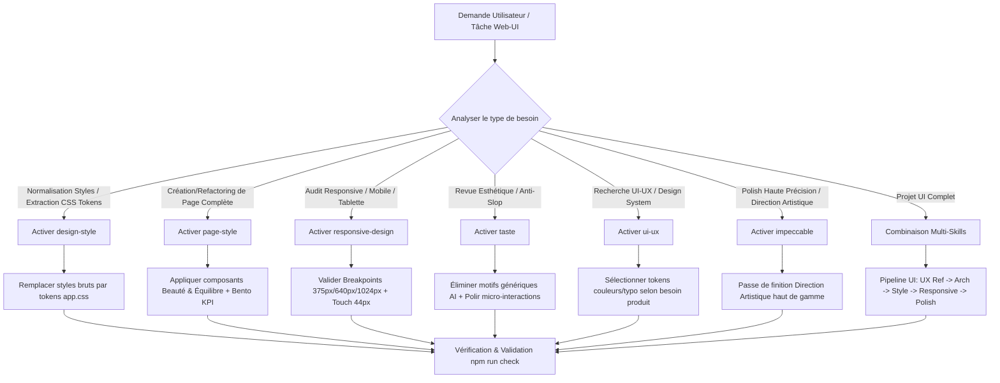

# 🌐 Orchestrateur Agent Web (`agent-web`)

Cette compétence orchestre l'ensemble des compétences spécialisées web, UI et UX situées dans le dossier `.agent/skills/agent-web/`. Elle permet d'orienter, d'activer et de combiner l'architecture Svelte 5, la normalisation des tokens CSS, le design adaptatif, les standards esthétiques "Beauté & Équilibre", l'anti-slop taste et le polish d'interface d'exception selon le besoin de la tâche.

---

## 🗂️ Matrice des Sous-Compétences Orchestrées

L'orchestrateur délègue et applique les directives des 6 compétences clés du dossier :

| Compétence | Fichier | Rôle & Périmètre d'Application |
| :--- | :--- | :--- |
| **`design-style`** | [`./design-style/SKILL.md`](file:///F:/Repos/KalySync/App/.agent/skills/agent-web/design-style/SKILL.md) | **Centralisation & Normalisation des Tokens CSS (`src/app.css`)**<br>• Zéro valeur brute inline (couleurs hex, ombres, béziers, typographie).<br>• Élimination des fallbacks inline redondants.<br>• Nomenclature sémantique explicite (`--ease-*`, `--shadow-*`, `--glass-*`, `--color-*`, `--font-*`). |
| **`page-style`** | [`./page-style/SKILL.md`](file:///F:/Repos/KalySync/App/.agent/skills/agent-web/page-style/SKILL.md) | **Standard de Page KalySync ("Beauté & Équilibre")**<br>• Fond nude/crème perlé, titres sérifs `Playfair Display` italique.<br>• Cartes Bento KPI cliquables, barres de recherche glassmorphism.<br>• Tableaux zebra interactifs avec barres indicatrices et fiches Hero. |
| **`responsive-design`** | [`./responsive-design/SKILL.md`](file:///F:/Repos/KalySync/App/.agent/skills/agent-web/responsive-design/SKILL.md) | **Adaptation Multi-Support (Mobile, Tablette, Desktop)**<br>• Breakpoints standards (`375px`, `640px`, `1024px+`).<br>• Zone tactile ≥ 44px, zéro scroll horizontal, dynamic viewports (`dvh`).<br>• Transformation dynamique sidebar/drawer et grilles adaptatives. |
| **`taste`** | [`./taste/SKILL.md`](file:///F:/Repos/KalySync/App/.agent/skills/agent-web/taste/SKILL.md) | **Directives Esthétiques Anti-Slop UI**<br>• Typographie contrastée et hiérarchisée, zéro fonte par défaut.<br>• Atmosphère riche (pas de noir/blanc pur), profondeur par calques.<br>• Espacements généreux, micro-interactions soignées (`:hover`, `:active`). |
| **`ui-ux`** | [`./ui-ux/SKILL.md`](file:///F:/Repos/KalySync/App/.agent/skills/agent-web/ui-ux/SKILL.md) | **Intelligence UI/UX & Références de Design System**<br>• Sélection guidée des palettes de couleurs, typographies et styles.<br>• Checklists d'accessibilité (WCAG AA), contrastes et ergonomie.<br>• Alignement des composants avec l'identité de marque KalySync. |
| **`impeccable`** | [`./impeccable/SKILL.md`](file:///F:/Repos/KalySync/App/.agent/skills/agent-web/impeccable/SKILL.md) | **Craft & Polish d'Exception (Direction Artistique)**<br>• Modes d'intervention (Persuade, Operate, Read, Experience).<br>• Élimination du design fade ou surchargé.<br>• Finitions de qualité production sans compromis. |

---

## 🗺️ Workflow d'Orchestration

Lorsqu'une tâche UI/UX ou Web est confiée à l'agent, l'orchestrateur suit le flux ci-dessous :



---

## 🎯 Combinaisons & Scénarios d'Orchestration

### Scénario 1 : Création ou Refactoring de Composant Svelte 5
* **Compétence Principale** : [`design-style`](file:///F:/Repos/KalySync/App/.agent/skills/agent-web/design-style/SKILL.md)
* **Consignes** :
  1. Utiliser exclusivement les Runes Svelte 5 (`$state`, `$derived`, `$props`).
  2. Conserver le composant sous la barre des **400 lignes**.
  3. Remplacer toute couleur ou taille en dur par les variables sémantiques de `src/app.css`.
  4. Interdiction absolue d'ajouter des attributs `placeholder`.

### Scénario 2 : Création d'une Nouvelle Page KalySync
* **Compétences Principales** : [`page-style`](file:///F:/Repos/KalySync/App/.agent/skills/agent-web/page-style/SKILL.md) + [`taste`](file:///F:/Repos/KalySync/App/.agent/skills/agent-web/taste/SKILL.md) + [`design-style`](file:///F:/Repos/KalySync/App/.agent/skills/agent-web/design-style/SKILL.md)
* **Consignes** :
  1. Appliquer le fond nude perlé `var(--color-bg-page-gradient)` et le titre sérif `Playfair Display` (`var(--font-heading)`).
  2. Structurer les statistiques clés sous forme de cartes Bento KPI (`.bento-stats-grid`).
  3. Utiliser les boutons premium (`.btn-primary-premium` / `.btn-sync-premium`) et tables à striage zebra.
  4. Valider l'harmonie visuelle anti-slop et l'absence de contours lourds.

### Scénario 3 : Audit & Adaptation Responsive Multi-Appareils
* **Compétence Principale** : [`responsive-design`](file:///F:/Repos/KalySync/App/.agent/skills/agent-web/responsive-design/SKILL.md)
* **Consignes** :
  1. Vérifier la fluidité sur Mobile (`375px`), Tablette (`768px`) et Desktop (`1440px`).
  2. S'assurer que toutes les zones de clic mesurent au moins `44px × 44px` sur mobile.
  3. Éliminer tout scroll horizontal non désiré (`overflow-x: hidden`).
  4. Utiliser des unités viewport dynamiques (`100dvh`) pour la hauteur d'écran mobile.

### Scénario 4 : Nettoyage & Extraction des Tokens CSS
* **Compétence Principale** : [`design-style`](file:///F:/Repos/KalySync/App/.agent/skills/agent-web/design-style/SKILL.md)
* **Consignes** :
  1. Détecter et éliminer les valeurs hexadécimales/rgba et béziers bruts.
  2. Supprimer les fallbacks inline redondants dans les `var()`.
  3. Centraliser toute nouvelle variable visuelle dans `src/app.css` avec un nom sémantique explicite.

### Scénario 5 : Polissage d'Interface & Direction Artistique (High Craft)
* **Compétences Principales** : [`impeccable`](file:///F:/Repos/KalySync/App/.agent/skills/agent-web/impeccable/SKILL.md) + [`taste`](file:///F:/Repos/KalySync/App/.agent/skills/agent-web/taste/SKILL.md)
* **Consignes** :
  1. Identifier le mode d'interaction (Operate pour le dashboard/CRM, Persuade pour la landing).
  2. Ajuster le rythme typographique, l'élévation des cartes et le feedback visuel (`:hover`, `:active`).
  3. Ne jamais tronquer le code et fournir des composants complets et directement exécutables.

---

## 📜 Invariants & Standards Absolus KalySync (`GEMINI.md`)

Toutes les interventions web/UI s'exécutent sous les contraintes strictes du projet :

1. **Tokens CSS Exclusifs (`src/app.css` & `ThemeProvider.svelte`)** :
   - **Interdiction** d'écrire des couleurs hex/nommées (`#803d4a`, `white`, `#ffffff`), polices ou tailles en dur.
2. **Zero Placeholder** :
   - **Interdiction** d'ajouter des attributs `placeholder="..."` dans les inputs/textareas.
3. **Runes Svelte 5 Exclusivement** :
   - `$state`, `$derived`, `$props`, `$effect` (Stores Svelte 4 proscrits).
4. **Limites de Taille** :
   - Fichiers `.svelte` < **400 lignes**.
5. **Isolation Multi-Tenant** :
   - Sécurité et filtrage `WHERE compagnie_id = ?` sur toute donnée affichée ou manipulée.

---

## 🌳 Arbre de Décision d'Activation

```
SI la demande concerne "extraire des couleurs/styles bruts vers app.css" :
   ➜ Charger `design-style/SKILL.md`

SI la demande concerne "créer ou refondre une page complète" :
   ➜ Charger `page-style/SKILL.md` + `taste/SKILL.md`

SI la demande concerne "corriger l'affichage mobile/tablette/desktop" :
   ➜ Charger `responsive-design/SKILL.md`

SI la demande concerne "améliorer l'esthétique, le contraste ou supprimer l'effet AI-generated" :
   ➜ Charger `taste/SKILL.md` + `ui-ux/SKILL.md`

SI la demande concerne "direction artistique complète ou polish haute qualité" :
   ➜ Charger `impeccable/SKILL.md` + `taste/SKILL.md`
```

---

## ✅ Checklist de Vérification d'Orchestration

Avant de finaliser une tâche prise en charge par `agent-web` :
- [ ] Les Runes Svelte 5 (`$state`, `$derived`, `$props`) sont-elles strictly utilisées ?
- [ ] Aucun composant `.svelte` ne dépasse 400 lignes ?
- [ ] Tous les styles utilisent-ils les tokens sémantiques de `src/app.css` (zéro couleur/taille en dur) ?
- [ ] Aucun attribut `placeholder` n'a été inséré dans les champs de formulaire ?
- [ ] Le design est-il testé et fluide sur Mobile (`375px`), Tablette (`768px`) et Desktop (`1024px+`) ?
- [ ] La commande `npm run check` s'exécute-t-elle sans erreur ?
