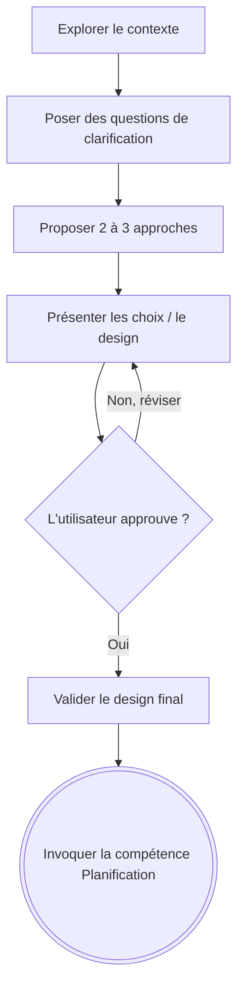

# 🧠 Brainstorming : Transformer les Idées en Conceptions (Designs)

## Aperçu

L'objectif de cette compétence est d'aider à transformer des idées initiales en conceptions, spécifications et plans complets grâce à un dialogue naturel et collaboratif avec l'utilisateur.

Commencez par comprendre la situation actuelle du projet, puis posez des questions de clarification **une à la fois** pour affiner l'idée. Une fois que vous comprenez clairement ce que vous devez construire, présentez une conception technique et obtenez l'approbation de l'utilisateur.

<HARD-GATE>
**NE PAS** invoquer d'autres compétences d'implémentation, écrire de code, scripter, échafauder un projet ou lancer une quelconque action d'implémentation tant que vous n'avez pas soumis un design et reçu l'approbation explicite de l'utilisateur.
Ceci s'applique à TOUS les projets, indépendamment du fait qu'ils paraissent simples.
</HARD-GATE>

## Anti-Pattern : "C'est trop simple pour avoir besoin d'un design"

*Chaque* projet doit passer par ce processus. Une liste de tâches à réaliser, un utilitaire ne contenant qu'une seule fonction, une modification de configuration de base, etc.
Les projets "simples" sont ceux où les hypothèses non vérifiées causent le plus de travail inutile. La conception peut être très courte (quelques phrases pour de vrais petits projets), mais vous DEVEZ la présenter à l'utilisateur et obtenir son accord.

## Quand utiliser Brainstorming vs /research

- **Brainstorming** (cette compétence) : se déclenche automatiquement dès qu'une implémentation est demandée. Dialogue de clarification une question à la fois, orienté "comment construire cette fonctionnalité précise".
- **`/research`** : se déclenche uniquement sur demande explicite de l'utilisateur. Recherche autonome et comparative, orientée "quelle est la meilleure option entre A et B".

Si l'utilisateur demande d'implémenter quelque chose et que le choix technologique sous-jacent n'est pas clair (ex. "ajoute un système de cache" sans préciser la techno), il est possible d'invoquer `/research` **pendant** la phase Brainstorming pour éclairer un point précis, avant de revenir présenter le design complet. Brainstorming reste la compétence englobante et obligatoire ; `/research` est un outil ponctuel qu'elle peut solliciter.

## 📋 Checklist de Vérification

Vous DEVEZ accomplir ces étapes pour chaque brainstorming **dans l'ordre** :

1. **Explorer le contexte du projet** : lisez les fichiers pertinents, la documentation, et regardez les derniers commits.
2. **Poser des questions de clarification** : une seule question à la fois, pour bien comprendre l'objectif, les contraintes et les critères de réussite.
3. **Proposer 2 ou 3 approches** : présentez les avantages, les inconvénients (trade-offs) et donnez votre recommandation personnelle.
4. **Présenter le design/conception technique** : en plusieurs sections (si besoin), et demandez l'approbation de l'utilisateur après chaque partie.
5. **Rédiger le document de conception (Optionnel mais recommandé si complexe)** : sauvegarder le plan et valider avec l'utilisateur.
6. **Passer à l'implémentation** : invoquer la compétence "Planification" pour créer le plan d'action d'implémentation.

## Process Flow (Arbre de Décision)

**L'état final de cette compétence doit être la transition vers la "Planification".** N'invoquez pas de script d'implémentation ni d'outil de code frontend.

## 💡 Détails Techniques & Bonnes Pratiques

### Comprendre l'idée (Exploration) :
- Posez **UNE seule question par réponse**. N'envoyez pas une liste de questions en bloc à l'utilisateur.
- Préférez les questions à choix multiples lorsque c'est pertinent. Les questions ouvertes sont acceptées, mais nécessitent souvent plus d'efforts de la part de l'utilisateur.
- Concentrez-vous sur le recueil de l'objectif, des contraintes et des critères nécessaires au succès.

### Explorer les approches :
- Proposez systématiquement 2 à 3 façons différentes de réaliser la fonctionnalité (avec les pour et les contre/trade-offs).
- Mettez toujours en avant l'une d'entre elles ("Je recommande l'option A parce que...").

### Présenter la conception (Design) :
- Abordez l'architecture, la création de composants spécifiques, le flux de données, la gestion des erreurs et la rédaction des tests nécessaires.
- Soyez prêt à revenir en arrière ou corriger si un point n'est finalement pas clair pour le développeur.
- **YAGNI (You Aren't Gonna Need It)** : Soyez impitoyable avec le super-flu, supprimez les fonctionnalités non spécifiquement demandées dans le cahier des charges.

## Après le Design (Validation Finale)

- Indiquez clairement la transition. 
- Demandez si le développeur est prêt à utiliser la compétence "Planification" (`Planification` skill) pour préparer la liste granulaire des tâches.