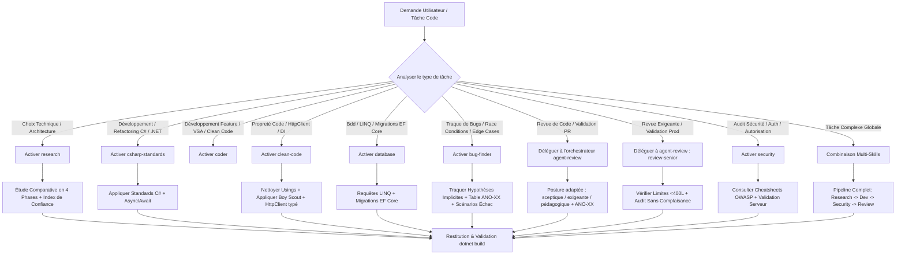

# 🤖 Orchestrateur Agent Code (`agent-code`)

Cette compétence orchestre l'ensemble des compétences spécialisées situées dans le dossier `.agent/skills/agent-code/`. Elle permet d'orienter, d'activer et de combiner les normes C# / .NET (ASP.NET Core, EF Core), les directives Clean Code, la recherche d'architecture, la sécurité OWASP, les revues de code et la chasse aux bugs selon le contexte de la tâche à accomplir.

---

## 🗂️ Matrice des Sous-Compétences Orchestrées

L'orchestrateur délègue et applique les directives des 7 compétences clés du dossier :

| Compétence | Fichier | Rôle & Périmètre d'Application |
| :--- | :--- | :--- |
| **`csharp-standards`** | [`./csharp-standards/SKILL.md`](./csharp-standards/SKILL.md) | **Normes de Développement C# / .NET, Architecture & Bonnes Pratiques**<br>• Conventions de nommage, nullable reference types, async/await, records, pattern matching, LINQ.<br>• Architecture : DI native, durées de vie, contrôle d'accès serveur, Minimal APIs, configuration (Options), logging.<br>• Performance (EF Core, allocations), anti-patterns et fichiers < **400 lignes**. |
| **`clean-code`** | [`./clean-code/SKILL.md`](./clean-code/SKILL.md) | **Clean Code, Boy Scout Rule & .NET**<br>• Nettoyage des using/logs inutilisés et règle du Boy Scout.<br>• Factorisation DRY et Single Source of Truth (`Constants.cs`).<br>• Client API centralisé (`HttpClient` typé) et gestion mémoire .NET. |
| **`database`** | [`./database/SKILL.md`](./database/SKILL.md) | **Gestion de la Base de Données avec Entity Framework Core**<br>• Requêtes LINQ paramétrées (protection injection native).<br>• Migrations EF Core, transactions, index et stratégie d'accès aux données.<br>• Validation stricte des entrées server-side (DataAnnotations / FluentValidation). |
| **`bug-finder`** | [`../code/bug-finder/SKILL.md`](../code/bug-finder/SKILL.md) | **Senior Bug Hunter, Traque de Bugs & Cas Limites**<br>• Détection de bugs d'exécution, race conditions, asynchronisme & edge cases.<br>• Traque des hypothèses implicites erronées (async/await, LINQ, EF Core).<br>• Classification `ANO-XX` (Critical/High/Medium) & scénarios d'échec. |
| **`security`** | [`./security/SKILL.md`](./security/SKILL.md) | **Sécurité OWASP & Zero Trust**<br>• Contrôle d'accès strict côté serveur et validation systématique.<br>• Consultation ciblée des cheatsheets OWASP (`./security/data/`).<br>• Protection XSS, CSRF, antiforgery, validation serveur et gestion des secrets. |
| **`coder`** | [`./coder/SKILL.md`](./coder/SKILL.md) | **Staff/Principal Engineer — VSA & Clean Code**<br>• Staff/Principal Engineer C# / .NET, Vertical Slice Architecture (VSA).<br>• Isolation stricte des slices, kernel `shared/`, dépendances unidirectionnelles.<br>• SRP strict, union discriminées, interdiction de `dynamic` / `any` / imports profonds inter-slices. |
| **`research`** | [`./research/SKILL.md`](./research/SKILL.md) | **Recherche Technique & Décision d'Architecture**<br>• Analyse comparative d'options (librairies, patterns .NET).<br>• Méthodologie en 4 phases avec rôle d'avocat du diable (*Devil's Advocate*).<br>• Évaluation des compromis et recommandations motivées avec niveau de confiance. |

> 🧹 **Historique de déduplication** :
> - `arch-csharp` et `best-practices` ont été **fusionnés dans `csharp-standards`** (contenu redondant : conventions, architecture DI, performance, anti-patterns).
> - Les postures de **revue de code** (`code-review`, `code-review-sceptique`, `code-review-extreme`, `review-senior`) sont **déléguées à l'orchestrateur `agent-review`**, seul propriétaire des reviews. `bug-finder` reste référencé ici pour l'usage développement (traque de bugs pendant le codage) ; il vit dans [`../code/bug-finder/`](../code/bug-finder/SKILL.md), version canonique unique partagée avec `agent-review`.
> - `mycode-review` et `review-senior` ont été retirés de ce dossier (copies obsolètes).

---

## 🗺️ Workflow d'Orchestration

Lorsqu'une tâche de code est confiée à l'agent, l'orchestrateur suit le flux ci-dessous :



---

## 🎯 Combinaisons & Scénarios d'Orchestration

### Scénario 1 : Développement de Service ou Endpoint ASP.NET Core
* **Compétences Principales** : [`csharp-standards`](./csharp-standards/SKILL.md) + [`clean-code`](./clean-code/SKILL.md)
* **Consignes** :
  1. Respecter les conventions C# (nommage, nullable, async/await, records).
  2. Respecter la limite de **400 lignes** par fichier/classe.
  3. Appliquer la règle du Boy Scout (nettoyer les using et logs inutilisés).
  4. Utiliser le client API centralisé (`HttpClient` typé / `IHttpClientFactory`) pour la communication HTTP sortante.

### Scénario 2 : Interaction Base de Données EF Core & Endpoints Server-Side
* **Compétences Principales** : [`database`](./database/SKILL.md) + [`security`](./security/SKILL.md)
* **Consignes** :
  1. Utiliser des requêtes LINQ paramétrées (jamais de SQL concaténé, `FromSqlInterpolated` si SQL brut).
  2. Valider l'appartenance de la ressource à l'utilisateur authentifié côté serveur.
  3. Valider l'intégralité des payloads entrants (DataAnnotations / FluentValidation) avant toute action métier.

### Scénario 3 : Traque de Bugs, Diagnostic & Race Conditions
* **Compétence Principale** : [`bug-finder`](../code/bug-finder/SKILL.md)
* **Compétences Complémentaires** : [`database`](./database/SKILL.md) / [`csharp-standards`](./csharp-standards/SKILL.md)
* **Consignes** :
  1. Inspecter les flux asynchrones (`Task`, `async/await`, `ConfigureAwait`), l'exécution LINQ (différée/immédiate) et les requêtes EF Core.
  2. Identifier les hypothèses implicites erronées.
  3. Dresser la **Table des Anomalies (ANO-XX)** classifiée par sévérité.

### Scénario 4 : Revue de Code Standard & Refactoring
* **Orchestrateur** : `agent-review` (délégation — les revues ne vivent plus dans ce dossier)
* **Compétence Complémentaire** : [`clean-code`](./clean-code/SKILL.md)
* **Consignes** :
  1. Activer `agent-review` puis charger le sous-skill de revue adapté (`code-review`, `code-review-sceptique`, `review-senior`).
  2. Vérifier qu'aucune constante magique n'est dupliquée (DRY).
  3. S'assurer que la **Table des Anomalies (ANO-XX)** est produite.

### Scénario 5 : Revue Avant Merge / Validation Production Exigeante
* **Orchestrateur** : `agent-review` (sous-skill `review-senior`)
* **Compétence Complémentaire** : [`security`](./security/SKILL.md)
* **Consignes** :
  1. Exiger la tolérance zéro sur le contrôle d'accès et la validation serveur.
  2. Bloquer tout usage de `dynamic`, toute fuite mémoire (`IDisposable` non disposé, événement non désabonné) ou classe dépassant 400 lignes.

---

## 📜 Invariants & Standards Absolus

Chaque sous-compétence du dossier `agent-code` s'exécute sous la contrainte des règles globales du projet :

1. **Contrôle d'Accès Obligatoire** :
   - **Tous** les endpoints doivent vérifier l'authentification et l'autorisation côté serveur avant toute action.
2. **Nullable Reference Types Activés** :
   - `<Nullable>enable</Nullable>` est la norme ; interdiction de neutraliser les avertissements de nullabilité.
3. **Limites de Taille & Découpage** :
   - Classes / fichiers < **400 lignes**, Services < **500 lignes**, Fonctions < **50 lignes**.
4. **Clean Code & Boy Scout** :
   - Suppression systématique des using/logs inutilisés et factorisation DRY dans `Constants.cs`.
5. **Testing Diamond & Checks** :
   - Exécution des validations via `dotnet build` et `dotnet test`.

---

## 🌳 Arbre de Décision d'Activation

```
SI la demande concerne "développer un service / endpoint / logique C#" :
   ➜ Charger `csharp-standards/SKILL.md` + `clean-code/SKILL.md`

SI la demande concerne "développer une feature complète / VSA / architecture verticale" :
   ➜ Charger `coder/SKILL.md`

SI la demande concerne "requêtes SQL / LINQ / migrations EF Core / endpoints server" :
   ➜ Charger `database/SKILL.md` + `security/SKILL.md`

SI la demande concerne "nettoyer le code / factoriser des classes ou constantes" :
   ➜ Charger `clean-code/SKILL.md`

SI la demande concerne "recherche de bugs / cas limites / race conditions / comportement inattendu" :
   ➜ Charger `../code/bug-finder/SKILL.md`

SI la demande concerne "comparer des choix d'architecture" :
   ➜ Charger `research/SKILL.md`

SI la demande concerne "revue de code / validation avant merge / revue exigeante" :
   ➜ Déléguer à l'orchestrateur `agent-review` (postures : code-review, code-review-sceptique, review-senior)

SI la demande concerne "audit de sécurité / auth / autorisation" :
   ➜ Charger `security/SKILL.md`
```

---

## ✅ Checklist de Vérification d'Orchestration

Avant de finaliser une tâche prise en charge par `agent-code` :
- [ ] Le code compile avec les warnings nullables activés sans erreur ?
- [ ] Les using et logs inutilisés ont-ils été nettoyés (Boy Scout Rule) ?
- [ ] Les endpoints vérifient-ils auth + autorisation côté serveur ?
- [ ] Aucune classe ne dépasse 400 lignes ?
- [ ] La validation `dotnet build` s'exécute-t-elle sans erreur ni nouveau warning ?
