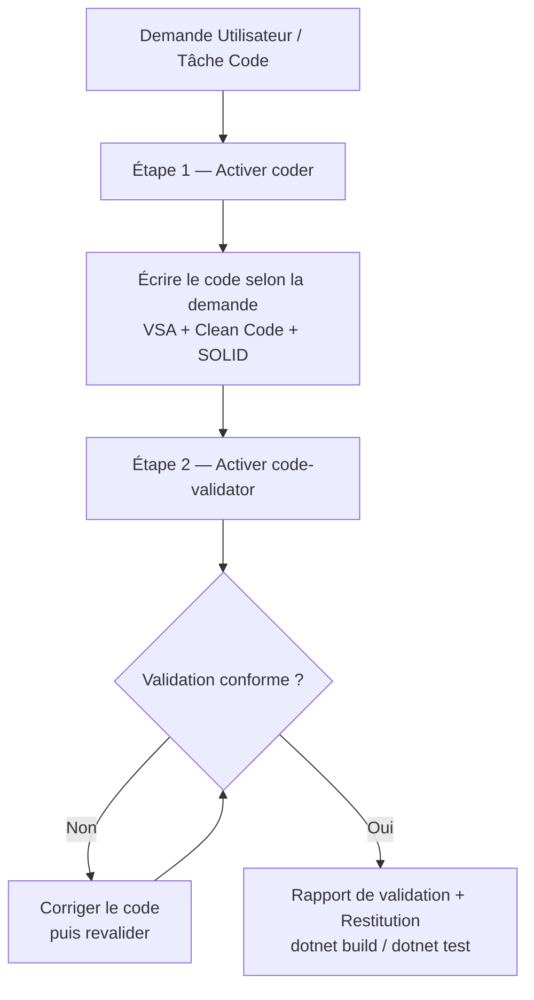

# 🤖 Orchestrateur Agent Code (`agent-code`)

Cet orchestrateur a **une mission unique : produire le code demandé par l'utilisateur**. Il exécute cette mission selon un pipeline séquentiel strict en 2 étapes, en s'appuyant sur les compétences spécialisées du dossier [`../code/`](../code/) pour l'écriture, la validation et le support technique.

---

## 🔄 Pipeline de Production de Code

Toute demande de code suit obligatoirement ce flux :



### Étape 1 — Écriture du code avec `coder` (obligatoire)

**Déclencheur** : systématique, dès réception de la demande.

* **Compétence** : [`../code/coder/SKILL.md`](../code/coder/SKILL.md)
* **Consignes** :
  1. Produire le code demandé en tant que Staff/Principal Engineer : Vertical Slice Architecture, Clean Code, SOLID.
  2. Respecter les standards C# / .NET et les skills de support mobilisés pendant l'écriture (voir section Support ci-dessous).
  3. Aucun placeholder, `dynamic`, `TODO` ou dette technique volontaire : si la demande est ambiguë, poser une question ciblée ou poser une hypothèse explicite documentée.

### Étape 2 — Validation et correction avec `code-validator` (obligatoire)

**Déclencheur** : systématique, immédiatement après l'étape 1 — la tâche n'est **pas terminée** tant que cette validation n'a pas eu lieu. Ne pas demander la permission : valider, corriger, rapporter.

* **Compétence** : [`../code/code-validator/SKILL.md`](../code/code-validator/SKILL.md)
* **Consignes** :
  1. Reconstituer la demande initiale (exigences explicites + implicites) et vérifier le code point par point.
  2. **Corriger directement** tout écart trouvé (raccourci silencieux, cas limite non traité, code factice, violation d'architecture), puis revalider.
  3. Terminer par le rapport de validation au format imposé (conformité, problèmes corrigés, points ouverts, verdict) et exécuter `dotnet build` / `dotnet test` sans erreur ni nouveau warning.

---

## 🗂️ Skills de Support (dossier `code/`)

Ces compétences ne sont pas des étapes du pipeline : elles sont **mobilisées en support** pendant les étapes 1 et 2 selon la nature du code produit. L'agent les charge au besoin pour garantir la qualité du code.

| Compétence | Fichier | Rôle & Périmètre de Support |
| :--- | :--- | :--- |
| **`csharp-standards`** | [`../code/csharp-standards/SKILL.md`](../code/csharp-standards/SKILL.md) | Normes C# / .NET : nommage, nullable reference types, async/await, records, LINQ, DI, Minimal APIs, performance, limites < **400 lignes**. |
| **`clean-code`** | [`../code/clean-code/SKILL.md`](../code/clean-code/SKILL.md) | Clean Code & Boy Scout Rule : using/logs inutilisés, factorisation DRY, `Constants.cs`, `HttpClient` typé centralisé. |
| **`database`** | [`../code/database/SKILL.md`](../code/database/SKILL.md) | EF Core : requêtes LINQ paramétrées, migrations, transactions, index, validation server-side des payloads. |
| **`security`** | [`../code/security/SKILL.md`](../code/security/SKILL.md) | Sécurité OWASP & Zero Trust : contrôle d'accès serveur, validation systématique, cheatsheets OWASP (`../code/security/data/`). |
| **`owasp-security`** | [`../code/owasp-security/SKILL.md`](../code/owasp-security/SKILL.md) | Audit OWASP Top 10 : référence approfondie pour tout endpoint exposé, authentification, autorisation. |
| **`bug-finder`** | [`../code/bug-finder/SKILL.md`](../code/bug-finder/SKILL.md) | Traque de bugs pendant le codage : race conditions, hypothèses implicites async/LINQ/EF Core, classification `ANO-XX`. |

> Les postures de **revue de code** (`code-review`, `code-review-sceptique`, `code-review-extreme`, `review-senior`) du dossier [`../code/`](../code/) restent la propriété de l'orchestrateur **`agent-review`** : `agent-code` produit le code, il ne fait pas la revue formelle. `code-validator` (étape 2) couvre la validation post-écriture ; pour une revue de code structurée ou un merge, déléguer à `agent-review`.

---

## 🎯 Scénarios d'Application du Pipeline

### Scénario 1 : Développement de Service ou Endpoint ASP.NET Core
* **Pipeline** : `coder` → `code-validator`.
* **Support mobilisé** : [`csharp-standards`](../code/csharp-standards/SKILL.md) + [`clean-code`](../code/clean-code/SKILL.md) + [`security`](../code/security/SKILL.md).

### Scénario 2 : Feature Complète / Slice Verticale
* **Pipeline** : `coder` → `code-validator`.
* **Support mobilisé** : [`csharp-standards`](../code/csharp-standards/SKILL.md) + [`database`](../code/database/SKILL.md) + [`bug-finder`](../code/bug-finder/SKILL.md).

### Scénario 3 : Interaction Base de Données EF Core
* **Pipeline** : `coder` → `code-validator`.
* **Support mobilisé** : [`database`](../code/database/SKILL.md) + [`security`](../code/security/SKILL.md) (requêtes LINQ paramétrées obligatoires, validation des payloads avant toute action métier).

### Scénario 4 : Refactoring
* **Pipeline** : `coder` → `code-validator` (le validateur vérifie qu'aucun changement de comportement hors périmètre n'a été introduit).
* **Support mobilisé** : [`clean-code`](../code/clean-code/SKILL.md) + [`bug-finder`](../code/bug-finder/SKILL.md).

---

## 📜 Invariants & Standards Absolus

Le pipeline s'exécute sous les règles globales du projet, quel que soit le code produit :

1. **Pipeline non négociable** : les deux étapes (`coder` puis `code-validator`) sont **toujours** exécutées, dans cet ordre.
2. **Contrôle d'Accès Obligatoire** : tous les endpoints vérifient authentification et autorisation côté serveur avant toute action.
3. **Nullable Reference Types Activés** : `<Nullable>enable</Nullable>` est la norme ; interdiction de neutraliser les avertissements.
4. **Limites de Taille & Découpage** : classes / fichiers < **400 lignes**, services < **500 lignes**, fonctions < **50 lignes**.
5. **Zéro code factice** : aucun `TODO`, stub, `NotImplementedException` ou test sans assertion ne doit survivre à l'étape 2.
6. **Validation finale** : `dotnet build` et `dotnet test` sans erreur ni nouveau warning.

---

## 🌳 Arbre de Décision d'Activation

```
TOUTE demande de code C# / .NET entre dans le pipeline :

ÉTAPE 1 — TOUJOURS :
           ➜ Charger ../code/coder/SKILL.md et écrire le code
           EN SUPPORT, charger au besoin :
             • standards/nommage/async        ➜ ../code/csharp-standards/SKILL.md
             • propreté / DRY / HttpClient    ➜ ../code/clean-code/SKILL.md
             • SQL / LINQ / EF Core           ➜ ../code/database/SKILL.md
             • endpoints / auth / autorisation ➜ ../code/security/SKILL.md
             • audit OWASP approfondi         ➜ ../code/owasp-security/SKILL.md
             • flux async / cas limites       ➜ ../code/bug-finder/SKILL.md

ÉTAPE 2 — TOUJOURS, immédiatement après l'étape 1 :
           ➜ Charger ../code/code-validator/SKILL.md
           • conforme    ➜ rapport final + dotnet build / dotnet test
           • non conforme ➜ corriger puis revalider (boucle courte)

HORS PÉRIMÈTRE — revue de code formelle / validation avant merge :
           ➜ Déléguer à l'orchestrateur agent-review
```

---

## ✅ Checklist de Vérification d'Orchestration

Avant de considérer une tâche de code comme terminée :
- [ ] Étape 1 (`coder`) : le code a-t-il été produit conformément à VSA, Clean Code et SOLID ?
- [ ] Étape 2 (`code-validator`) : la validation a-t-elle été exécutée avec rapport final (verdict explicite) ?
- [ ] Les écarts détectés par le validateur ont-ils été corrigés directement, puis revalidés ?
- [ ] Les skills de support pertinents ont-ils été mobilisés pendant l'écriture ?
- [ ] Le code compile avec les warnings nullables activés, sans erreur ni nouveau warning (`dotnet build` / `dotnet test`) ?
- [ ] Aucun `TODO`, stub, code factice ou classe > 400 lignes ?
- [ ] Les endpoints vérifient-ils auth + autorisation côté serveur ?
