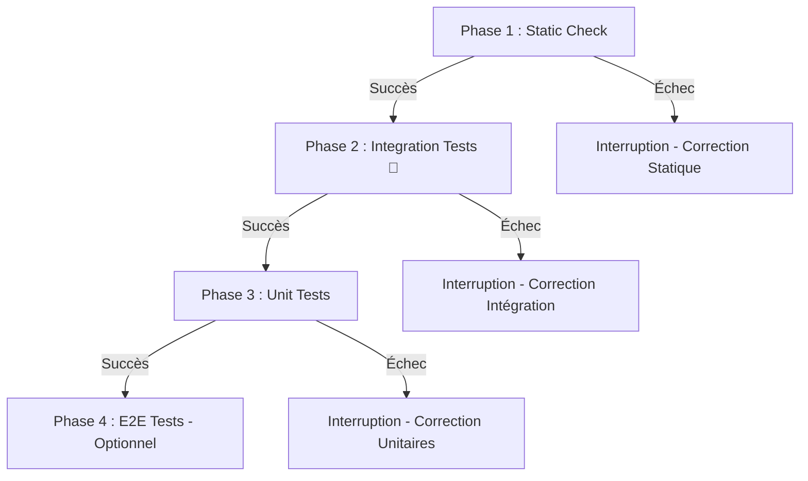

# 🧪 Skill Orchestrateur de Tests (Modèle Testing Trophy / Diamond)

## 📌 Philosophie & Stratégie
Ce skill est l'**orchestrateur maître** pour toutes les activités de test des projets **C# / .NET**.
Il applique la philosophie du **Testing Trophy / Diamond** (Kent C. Dodds) :
> *« Write tests. Not too many. Mostly integration. »*

Les **tests d'intégration** constituent le cœur (la partie la plus large) du diamant de test car ils offrent le meilleur ratio coût/confiance en simulant de réelles interactions entre services, endpoints ASP.NET Core et base de données réelle (Testcontainers).

---

## 📂 Sous-Skills Disponibles & Guide de Décision

Cet orchestrateur s'appuie sur des **sous-skills spécialisés** situés dans le sous-dossier `tests/`. Utilisez le tableau ci-dessous pour savoir quel sous-skill consulter ou invoquer selon la tâche :

| Besoin / Périmètre | Sous-Skill | Description & Portée |
|---|---|---|
| **API, DB, Middleware, Services** | [`testing-integration`](./testing-integration/SKILL.md) | **Cœur du diamant 💎** : Endpoints ASP.NET Core (Minimal API / contrôleurs), requêtes EF Core, `WebApplicationFactory`, middleware. |
| **Fonctions pures, Helpers, Services isolés** | [`testing-unit`](./testing-unit/SKILL.md) | Tests d'isolation xUnit : math, formatage, gestion DST/dates, 100% couverture de branches et cas limites. |
| **Parcours Utilisateur & UI** | [`testing-e2e`](./testing-e2e/SKILL.md) | Scénarios de bout en bout avec Playwright (Login → Action → Check), happy & unhappy paths, axe-core. |
| **Pratiques & Sélecteurs Playwright** | [`testing-playwright`](./testing-playwright/SKILL.md) | Guide technique Playwright : sélecteurs sémantiques (`getByRole`), auto-wait, traces et débogage E2E. |
| **Philosophie & Architecture Diamond** | [`testing-diamond`](./testing-diamond/SKILL.md) | Directives d'architecture de test et structuration de la suite selon Kent C. Dodds. |

```
Arbre de décision rapide :
Demande de test ou nouvelle fonctionnalité ?
  ├── API / Base de données / Middleware         → testing-integration
  ├── Fonction isolée / Service / Calcul date    → testing-unit
  ├── Navigation complète / Parcours critique    → testing-e2e (+ testing-playwright)
  └── Exécution globale / Validation complète    → tests (Skill Maître)
```

---

## 🚀 Pipeline d'Orchestration des Tests

Lors de l'activation de ce skill ou d'une demande d'exécution de la suite de tests, exécuter les phases séquentiellement selon l'ordre strict ci-dessous :



### Phase 1 : Validation Statique (Static Check)
- **Commande** : `dotnet build` (warnings traités comme erreurs) + `dotnet format --verify-no-changes`
- **Objectif** : Valider les types C# (nullable reference types), les conventions (analyzers Roslyn / `.editorconfig`), et la cohérence du projet.
- **Fail-Fast** : Si la validation statique échoue, arrêter l'exécution immédiatement et corriger les erreurs avant de poursuivre.

### Phase 2 : Tests d'Intégration — Cœur du Diamant (Integration Tests 💎)
- **Commande** : `dotnet test --filter "Category=Integration"`
- **Objectif** : **Cœur prioritaire du diamant.** Tester l'intégration réelle entre plusieurs modules, la logique métier et la base de données (Testcontainers ou SQLite in-memory) via `WebApplicationFactory` (`.IntegrationTests.cs`). Référencer le sous-skill [`testing-integration`](./testing-integration/SKILL.md).
- **Fail-Fast** : En cas d'échec sur la phase d'intégration, interrompre le pipeline et corriger les régressions prioritaires.

### Phase 3 : Tests Unitaires (Unit Tests)
- **Commande** : `dotnet test --filter "Category!=Integration"`
- **Objectif** : Valider les fonctions utilitaires isolées, helpers de date/heure (gestion DST, UTC), et fonctions pures. Référencer le sous-skill [`testing-unit`](./testing-unit/SKILL.md).

### Phase 4 : Tests E2E / Régression Visuelle (Optionnel / À la demande)
- **Commande** : `npx playwright test` (ou `dotnet test` avec Microsoft.Playwright)
- **Objectif** : Exécuter la suite Playwright pour vérifier l'interface utilisateur dans un vrai navigateur. Référencer les sous-skills [`testing-e2e`](./testing-e2e/SKILL.md) et [`testing-playwright`](./testing-playwright/SKILL.md).

---

## 🛠️ Directives d'Exécution & Permissions
- **Permissions autorisées** : Les commandes `dotnet build`, `dotnet test` et `dotnet format` peuvent être exécutées librement par l'agent sans solliciter d'autorisation utilisateur répétitive.
- **Rapport de Synthèse** : À la fin de l'orchestration, présenter un tableau de synthèse clair indiquant l'état de chaque niveau du diamant.
